# Práctica 1: Configuración Inicial y Primer Endpoint en Spring Boot

**Autor:** John Tigre  
**Materia:** Programación y Plataformas Web  
**Universidad Politécnica Salesiana**

---

## 1. Verificación de Java
Se verificó la instalación del entorno de ejecución de Java, confirmando la versión compatible (Java 25) para correr el framework.

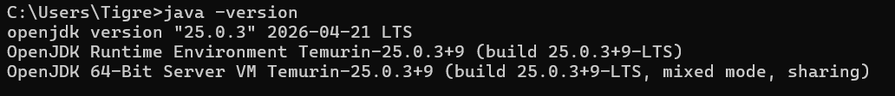

## 2. Servidor Spring Boot en ejecución
El proyecto fue compilado usando Gradle. Se inicializó el servidor embebido Tomcat en el puerto 8080 sin necesidad de configuraciones externas.

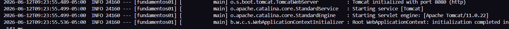

## 3. Prueba del Endpoint `/api/status`
Se realizó una petición HTTP tipo GET desde el navegador hacia la ruta del controlador, obteniendo una respuesta exitosa con código 200 OK y el Body en formato JSON.

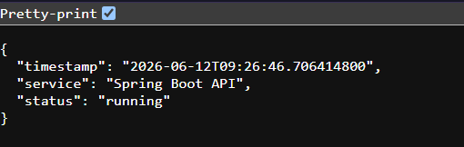

## 4. Estructura de Controladores
Verificación de la creación correcta del paquete y la clase del controlador mediante línea de comandos.

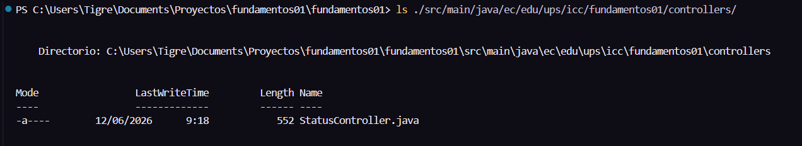

---

## 5. Configuración Global con application.yml
Durante la práctica, se migró el archivo de configuración de `application.properties` a `application.yml` para utilizar una sintaxis más limpia, estructurada y jerárquica. Se configuró el puerto del servidor y se estableció un prefijo global para la API:

```yaml
server: 
    port: 8080
    servlet:
        context-path: /api

spring: 
    application:
        name: fundamentos01
```
Al definir `/api` como el `context-path`, todas las rutas de la aplicación incluyen automáticamente este prefijo de forma estandarizada.

## 6. Modelo de Dominio y Controlador (Students)
Se implementó una nueva estructura modular organizando el código por dominios (dentro del paquete `students` se crearon los subpaquetes `models` y `controllers`).

* **Model (`Student.java`):** Define la estructura de datos del estudiante con sus atributos (`id`, `name`, `age`), constructores y métodos encapsulados (getters y setters).
* **Controller (`StudentController.java`):** Gestiona las peticiones HTTP relacionadas con los estudiantes. Se utilizó `@RestController` y se agruparon las rutas bajo `@RequestMapping("/students")`. Además, se inicializó una lista simulando una base de datos en memoria para retornar los datos.

## 7. Prueba de los Endpoints de Estudiantes
Se probaron los nuevos endpoints mapeados en el controlador mediante peticiones HTTP GET:

**Endpoint `/api/students`:** Retorna la lista completa de objetos `Student` serializados automáticamente en formato JSON.
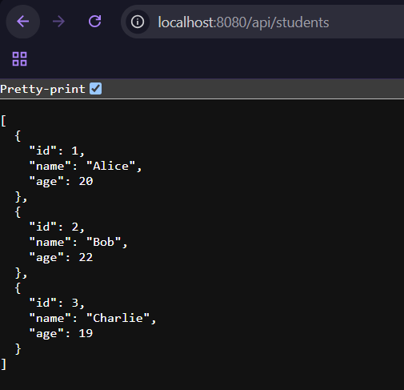

**Endpoint `/api/students/count`:** Retorna un texto plano (String) con el conteo total de estudiantes registrados en la lista.
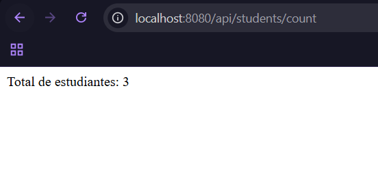

---

## 8. Explicación y Conclusiones

**Sobre el funcionamiento de los endpoints:** Entendí que un endpoint es una ruta específica de comunicación que el servidor expone al exterior. Al configurar la clase con `@RestController`, `@RequestMapping` y los métodos con `@GetMapping`, logramos que cuando el cliente (navegador web) realiza una petición HTTP GET a esas rutas, el servidor ejecute la lógica interna y retorne automáticamente una respuesta estructurada (JSON o texto plano), sin necesidad de devolver una página HTML completa.

**Sobre la función general de Spring Boot:** Comprendí que Spring Boot simplifica radicalmente la creación de backends gracias a su auto-configuración y al uso de servidores embebidos. Al agregar la dependencia `spring-boot-starter-web` en el archivo `build.gradle`, el framework integró e inició automáticamente Apache Tomcat en el puerto 8080. Esto elimina la necesidad de instalar, configurar y desplegar servidores externos manualmente, permitiéndonos enfocarnos directamente en la lógica de negocio, la creación de modelos y la construcción de la API.

# Práctica 3: Construcción de una API REST usando DTOs y Mappers

En esta práctica se estructuró el flujo de datos utilizando DTOs (Data Transfer Objects) para controlar lo que ingresa y sale de la API, separando la lógica mediante Mappers. 

Se realizaron las pruebas de los endpoints estructurados (usando el recurso de usuarios/productos) para confirmar la correcta respuesta del servidor mediante el cliente Bruno.

**GET Global (Lista completa):** Retorna el arreglo JSON con todos los registros activos.
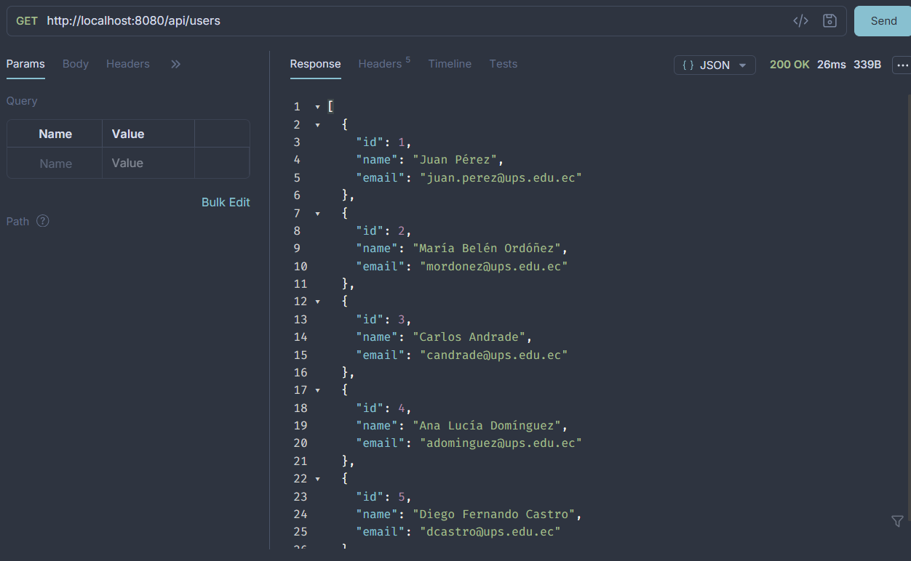

**GET por ID:** Retorna el JSON de un registro específico solicitado por su ID.
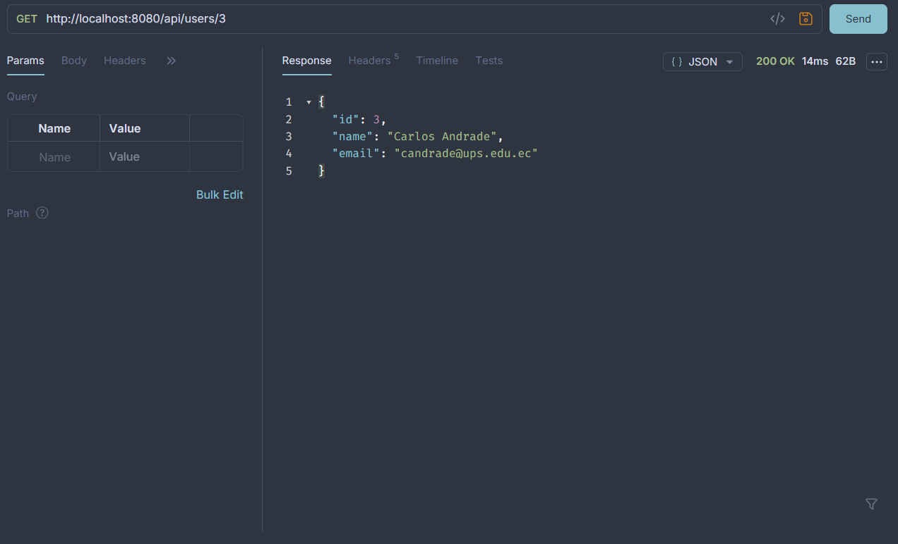

**DELETE (Exitoso):** Eliminación correcta de un registro existente devolviendo un estado 200 OK.
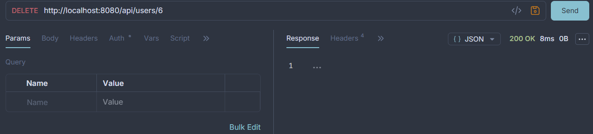

**DELETE (Fallido):** Intento de eliminación de un registro que no existe, lanzando una excepción controlada (Status 500).
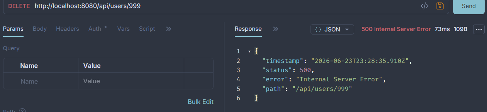

---

# Práctica 4: Controladores + Servicios + Lógica de Negocio

Para mejorar la arquitectura, se sacó toda la lógica de negocio de los controladores y se delegó a la capa de servicios. 

**Capa de Servicio (`ProductServiceImpl.java`):** Se utiliza la anotación `@Service` para registrar la clase. Aquí se aplican las reglas de negocio, el uso de `.stream()` para las búsquedas y el mapeo de datos.
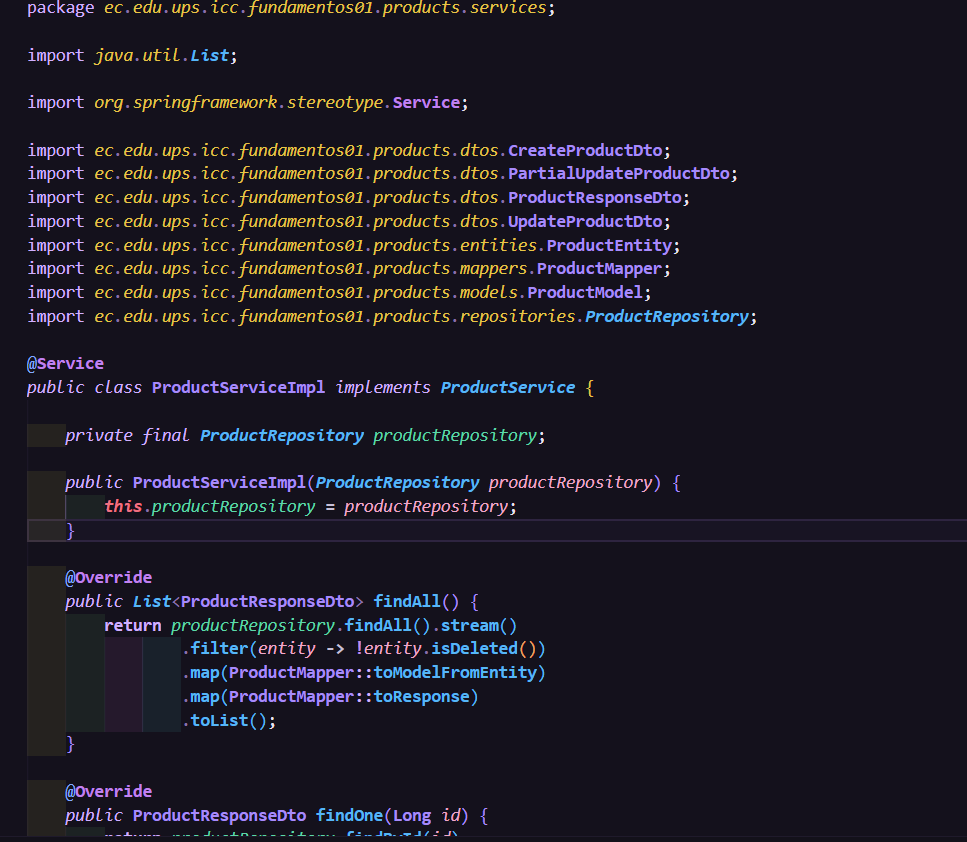

**Capa de Controlador (`ProductsController.java`):** Queda completamente limpio de lógica. Solo define las rutas y delega las tareas al servicio.
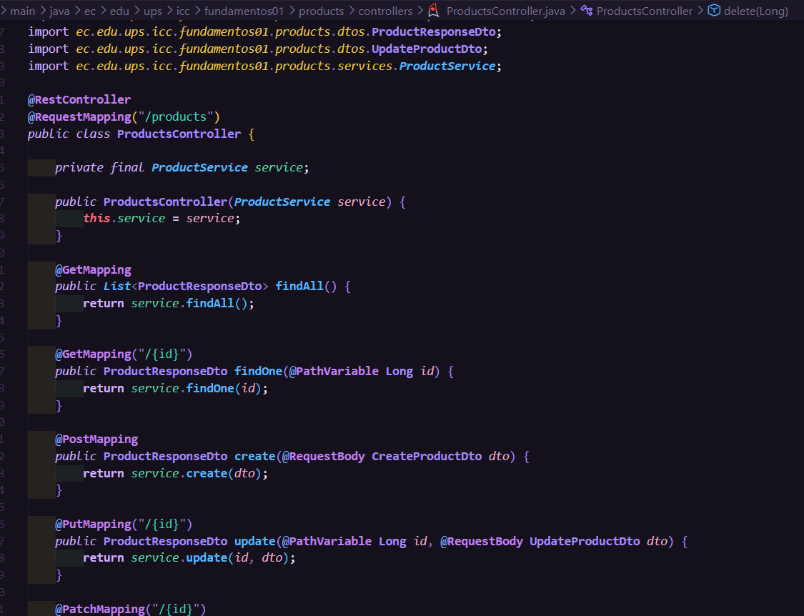

### ¿Cómo se inyecta el servicio en el controlador?
Se realiza mediante **Inyección de Dependencias por Constructor**. Al declarar la variable `private final ProductService service;` y pasarla en el constructor del controlador, Spring Boot busca automáticamente la clase que tiene la anotación `@Service` (`ProductServiceImpl`), crea la instancia por nosotros y la inyecta para que esté lista para usarse.

---

# Práctica 5: Persistencia real con PostgreSQL y Repositorios

Se eliminó el almacenamiento temporal en memoria y se integró una base de datos real usando Docker, PostgreSQL y Spring Data JPA para asegurar la persistencia de la información.

**Registros guardados en PostgreSQL (Tabla Products):**
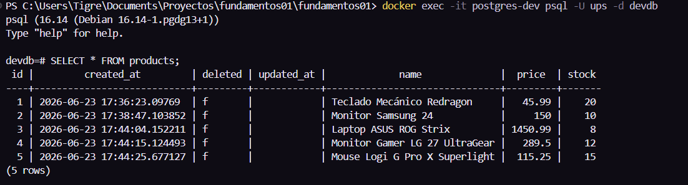

**Registros guardados en PostgreSQL (Tabla Users):**
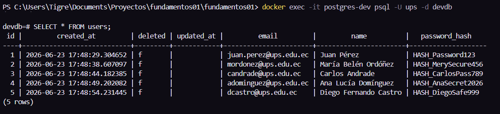

### Flujo de datos y el uso de BaseEntity
El flujo de datos funciona así: la petición HTTP llega como JSON al **Controlador**, el cual la transforma en un DTO. El **Servicio** recibe el DTO, aplica la lógica y lo convierte en una Entidad (Entity) mediante el Mapper. Finalmente, el **Repositorio** toma esta entidad y usa Hibernate para generar la sentencia SQL que guarda los datos físicamente en **PostgreSQL**. Cuando se consultan datos, el viaje es a la inversa (BD -> Entidad -> Modelo -> DTO -> Cliente).

**Uso de `BaseEntity`:** Es una superclase clave (marcada con `@MappedSuperclass`) que agrupa los campos de auditoría (`id`, `createdAt`, `updatedAt`, `deleted`). Al hacer que las entidades como `UserEntity` o `ProductEntity` hereden de ella, evitamos repetir código en cada tabla y estandarizamos la generación de IDs y el borrado lógico en todo el proyecto.
# Práctica 6: Validación de DTOs y Control de Datos de Entrada

En esta práctica se integró Jakarta Validation para proteger la API de datos incorrectos antes de que lleguen a la capa de servicios o base de datos. Se implementaron anotaciones como `@NotBlank`, `@NotNull`, `@Size` y `@Min` en los DTOs, y se activaron mediante la anotación `@Valid` en los controladores.

Además, se implementaron reglas de negocio estrictas en los servicios para evitar la interacción con registros eliminados lógicamente.

**1. Error por validación de entrada (POST inválido):**
El controlador detiene la petición y devuelve un estado `400 Bad Request` al intentar enviar un nombre vacío y valores negativos para precio y stock.
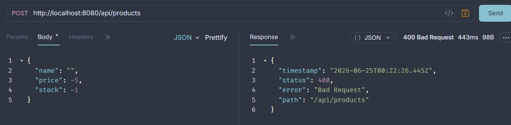

**2. Regla de negocio: Bloqueo de actualización a producto eliminado:**
Al intentar realizar un método `PUT` sobre un producto que previamente fue marcado como eliminado (deleted = true), el servicio lanza una excepción `IllegalStateException` controlada.
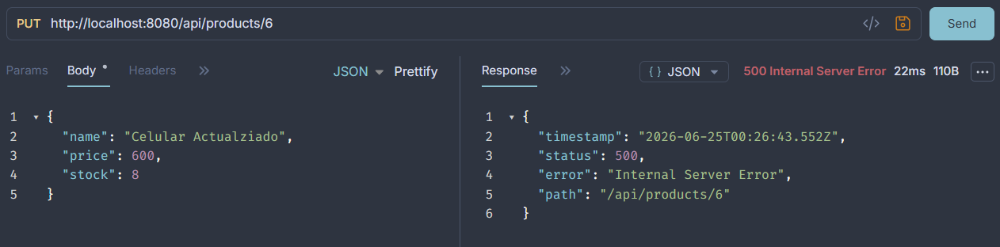

**3. Regla de negocio: `findAll` no devuelve productos eliminados:**
La lista global excluye automáticamente los registros eliminados lógicamente, demostrando la eficacia del filtrado por streams en el servicio.
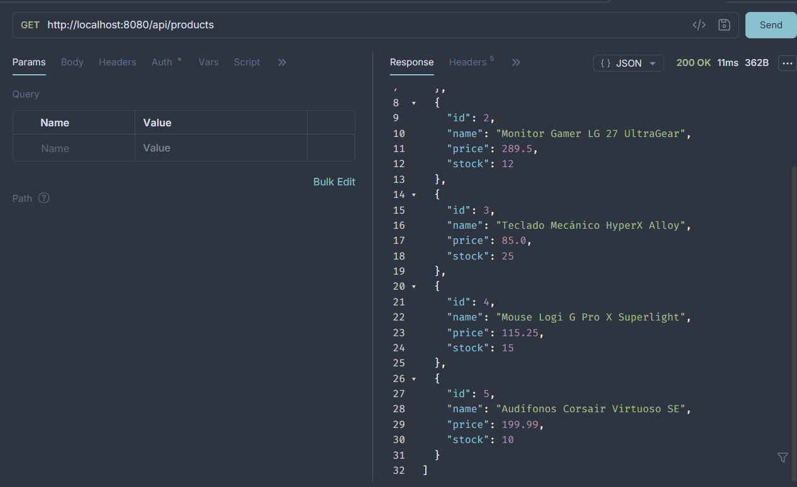

# Práctica 7: Manejo Global de Errores y Excepciones

En esta práctica se implementó un sistema global para el manejo de excepciones, eliminando el uso de errores genéricos (`IllegalStateException`) y reemplazándolos por excepciones de dominio personalizadas (`NotFoundException`, `ConflictException`, `BadRequestException`). 

Mediante el uso de `@RestControllerAdvice`, todos los errores capturados en la API se traducen ahora a un formato de respuesta único y estandarizado (`ErrorResponse`), mejorando la claridad para el cliente.

**1. Error por producto inexistente (404 Not Found):**
Al intentar consultar un producto con un ID que no existe en la base de datos (o que ha sido eliminado lógicamente), el sistema captura la excepción `NotFoundException` y devuelve un estado 404.
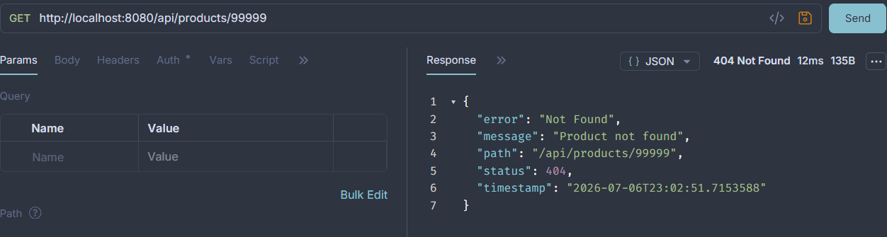

**2. Conflicto lógico por producto duplicado (409 Conflict):**
Se implementó una regla de negocio que prohíbe registrar dos productos con el mismo nombre. Al intentarlo, el servicio lanza una `ConflictException`, devolviendo un estado 409.
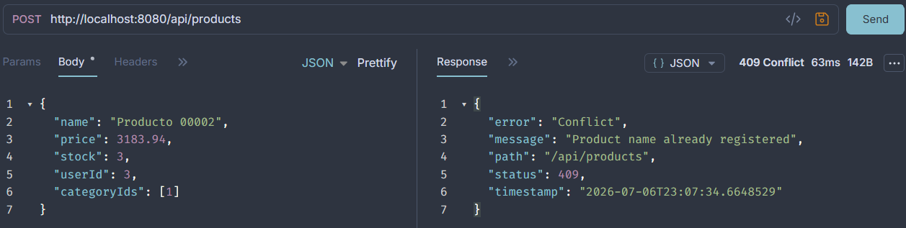

**3. Error de validación de DTO (400 Bad Request):**
Al enviar un payload con datos inválidos (nombre vacío, precio negativo, stock negativo), la excepción `MethodArgumentNotValidException` es interceptada por el handler global. La respuesta incluye un mapa detallado (`details`) especificando el error exacto de cada campo.
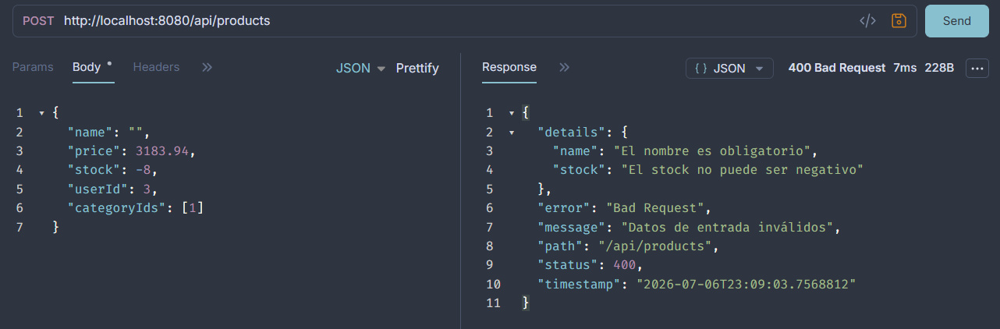

# Práctica 8: Relaciones ManyToOne, Foreign Keys y Consultas Relacionales

En esta práctica se implementó el diseño de bases de datos relacionales directamente desde JPA. Los productos dejaron de ser entidades aisladas para relacionarse con los usuarios (propietarios) y con un nuevo módulo de categorías, validando la integridad referencial antes de cualquier inserción o actualización.

**1. Estructura de la tabla Products en PostgreSQL:**
Mediante el uso de anotaciones relacionales en la entidad, Hibernate generó automáticamente las columnas `user_id` y `category_id` como claves foráneas (Foreign Keys) en la base de datos, garantizando la integridad de los datos a nivel de motor SQL.
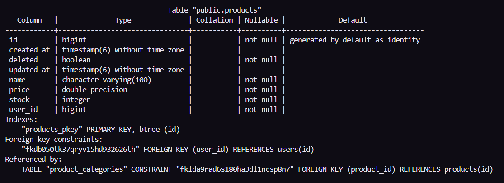

**2. Creación de Producto con relaciones anidadas:**
Al crear un producto, el DTO de entrada recibe los IDs relacionales, pero el DTO de respuesta (`ProductResponseDto`) formatea la salida para mostrar los objetos completos y anidados (`owner` y `category`), mejorando la lectura de la API para el cliente frontend.
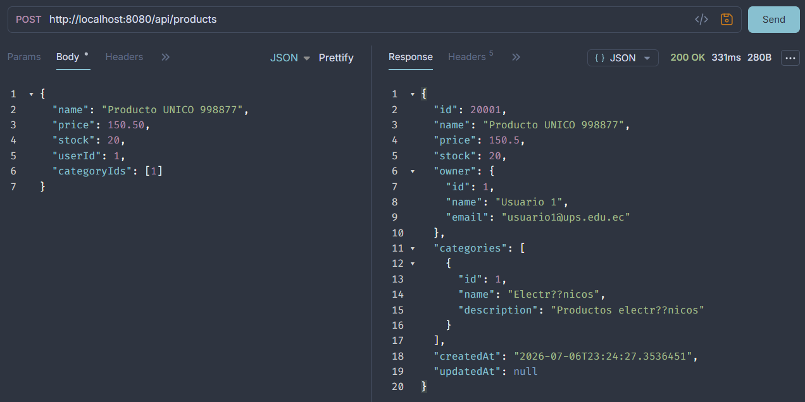

**3. Consulta de productos filtrados por categoría:**
Se implementaron consultas derivadas en `ProductRepository` (`findByCategory_IdAndDeletedFalse`) para obtener listas de productos específicos asociados a una clave foránea, optimizando las búsquedas.
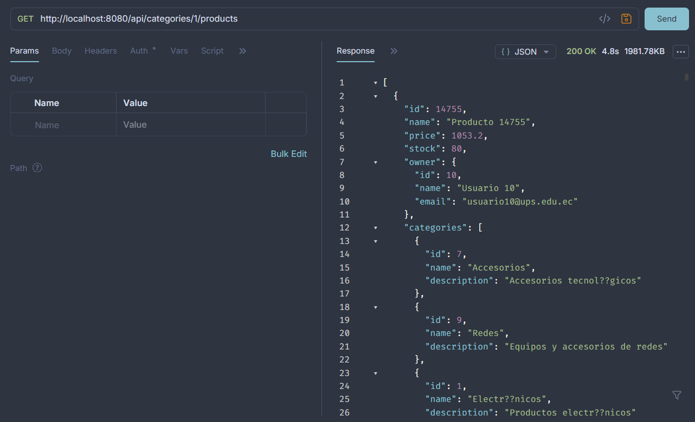

---

### Explicación Breve: Relacionando Entidades en JPA

**¿Cómo se relaciona ProductEntity con UserEntity y CategoryEntity usando `@ManyToOne` y `@JoinColumn`?**

En el modelo de dominio, un usuario puede crear múltiples productos y una categoría puede agrupar múltiples productos. Visto desde la perspectiva del producto, la relación es de "Muchos a Uno". 

* **`@ManyToOne`**: Esta anotación se coloca en los atributos `owner` (tipo `UserEntity`) y `category` (tipo `CategoryEntity`) dentro de la clase `ProductEntity`. Le indica a Spring Data JPA que muchos productos van a estar vinculados a un único registro en la tabla de usuarios y a un único registro en la tabla de categorías. Se configuró con `fetch = FetchType.LAZY` para que estos datos relacionados solo se carguen en memoria cuando sean explícitamente solicitados, mejorando el rendimiento.
* **`@JoinColumn`**: Acompaña a la anotación anterior y le indica explícitamente a Hibernate cómo se debe llamar la columna física en la tabla `products` de PostgreSQL que actuará como clave foránea (por ejemplo: `@JoinColumn(name = "user_id")` y `@JoinColumn(name = "category_id")`). Esto crea la restricción relacional directa entre las tablas.
# Práctica 9: Request Parameters, Consultas Relacionadas y Filtrado con JPA

En esta práctica se implementaron endpoints semánticos y consultas con filtros dinámicos mediante `@ModelAttribute` y Query Parameters. Además, la arquitectura de la base de datos evolucionó, pasando de una relación "Muchos a Uno" a "Muchos a Muchos" entre Productos y Categorías, utilizando una tabla intermedia.

**1. Producto creado con varias categorías (ManyToMany):**
El DTO de entrada fue actualizado para recibir un arreglo de `categoryIds`. Al persistir la entidad, Hibernate se encarga de insertar los registros automáticamente en la nueva tabla intermedia `product_categories`.
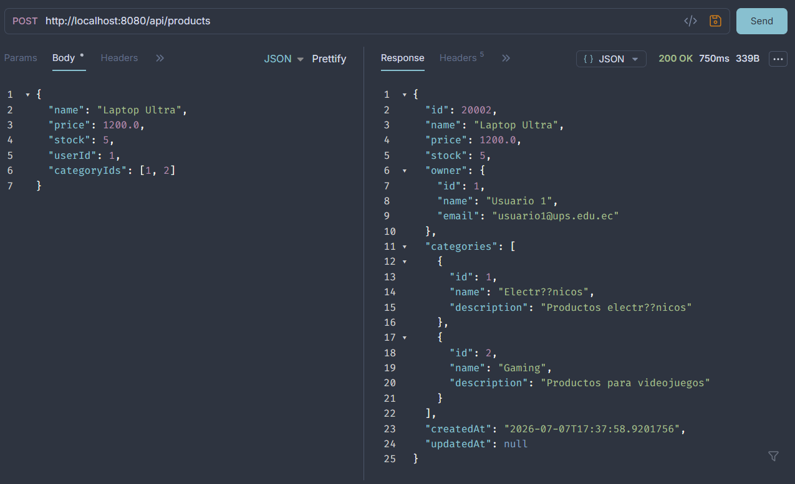

**2. Consulta semántica con filtros por usuario:**
Se expuso el endpoint semántico `/api/users/{id}/products`. Se combinaron filtros opcionales como `name` y `minPrice`, los cuales son procesados directamente en la base de datos mediante consultas derivadas dinámicas.
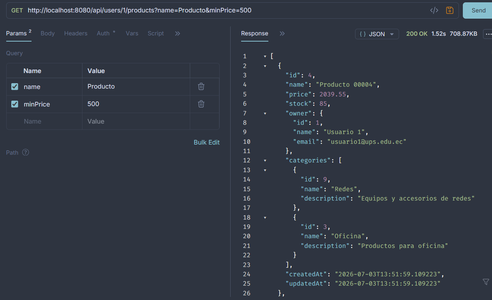

**3. Consulta semántica con filtros por categoría:**
Uso del endpoint `/api/categories/{id}/products` filtrando por el `userId` del propietario. En esta fase, la consulta de JPA requirió el uso de `JOIN` y `DISTINCT` para navegar por la tabla intermedia y evitar resultados duplicados.


---

### Explicación Breve

**¿Por qué se usa ProductService y ProductRepository para consultar productos aunque el endpoint esté dentro del contexto `/users/{id}/products` o `/categories/{id}/products`?**
Porque el recurso principal que se está solicitando, procesando y devolviendo es un "Producto". Según el Principio de Responsabilidad Única (SRP) y la arquitectura orientada a dominios, los servicios y repositorios de usuarios/categorías solo deben manejar su propia lógica. Los nuevos controladores semánticos (como `UserProductsController`) definen la ruta relacional, pero delegan correctamente la extracción y el filtrado de la información al `ProductService`, manteniendo el código modular, escalable y desacoplado.

**¿Qué cambió al pasar de Product N ──── 1 Category a Product N ──── N Category?**
A nivel de base de datos, se eliminó la clave foránea `category_id` de la tabla `products` y se creó una tabla intermedia (`product_categories`). A nivel de código Java, se cambió la anotación `@ManyToOne` por `@ManyToMany` y el atributo individual `category` pasó a ser una colección `Set<CategoryEntity>`. Finalmente, los DTOs de entrada y salida se modificaron para manejar colecciones (`categoryIds`), y el repositorio requirió usar `JOIN` explícitos para realizar las búsquedas correctamente a través de la tabla intermedia.
# Práctica 10: Paginación de Productos con Page, Slice y Pageable

En esta última práctica se abordó un problema crítico de escalabilidad: el alto consumo de recursos y lentitud al realizar consultas globales (`findAll`) en tablas con gran volumen de registros. Se implementó paginación desde el backend utilizando Spring Data JPA mediante las interfaces `Pageable`, `Page` y `Slice`, permitiendo devolver fragmentos controlados de datos y optimizando las consultas SQL generadas.

## Resultados y Evidencias

**1. Respuesta de paginación con Page**
Al consumir el endpoint `/api/products/page?page=0&size=5`, la respuesta incluye los metadatos completos de la paginación generados mediante una consulta `COUNT` adicional en la base de datos (se evidencian `totalElements`, `totalPages`, `number`, `size`, `first`, `last`).
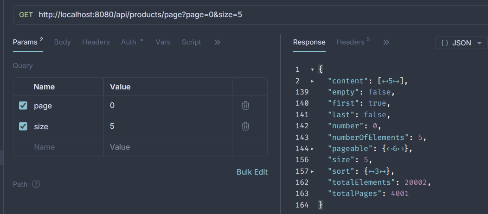

**2. Respuesta de paginación con Slice**
Al consumir el endpoint `/api/products/slice?page=0&size=5`, la respuesta incluye el bloque de productos, pero omite los metadatos de totales (`totalElements` y `totalPages`). Esto demuestra una consulta más ligera ideal para "scroll infinito".
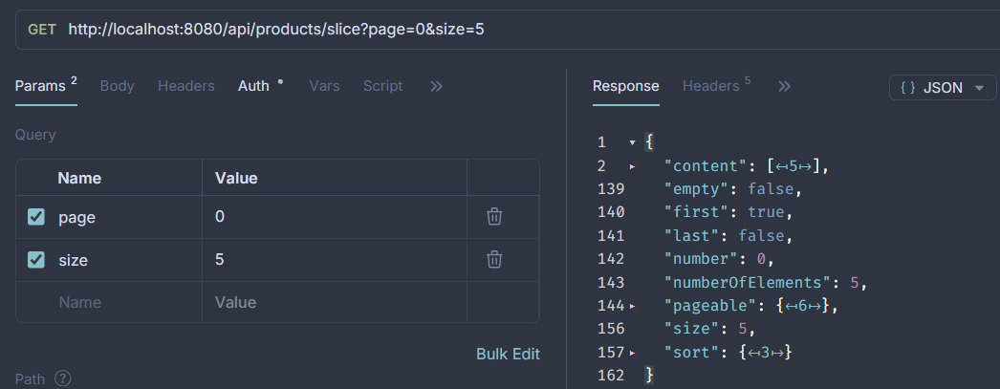

**3. Error por paginación inválida (400 Bad Request)**
Se implementó validación en el `PaginationDto`. Al enviar parámetros incorrectos (como una página negativa: `page=-1&size=0`), el handler global intercepta el `BindException` y devuelve un error estructurado validando la entrada.
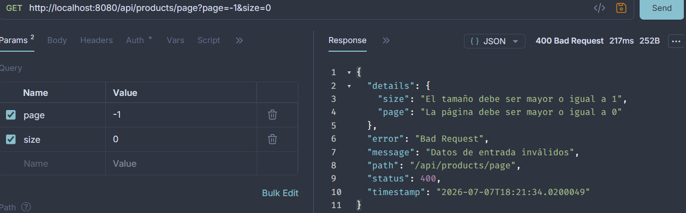

**4. Endpoint de categoría paginado (Page)**
Se aplicó la paginación a las consultas relacionales con filtros. Al consumir `/api/categories/2/products/page?page=0&size=5`, se obtienen estrictamente los productos de dicha categoría segmentados en páginas exactas.
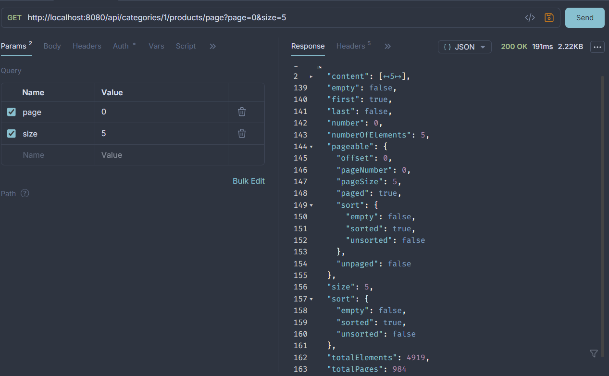

**5. Endpoint de categoría paginado (Slice)**
Al consumir la variante `/api/categories/2/products/slice?page=0&size=5`, se obtienen los productos filtrados por categoría con la carga ligera de `Slice`, optimizando el tiempo de respuesta.
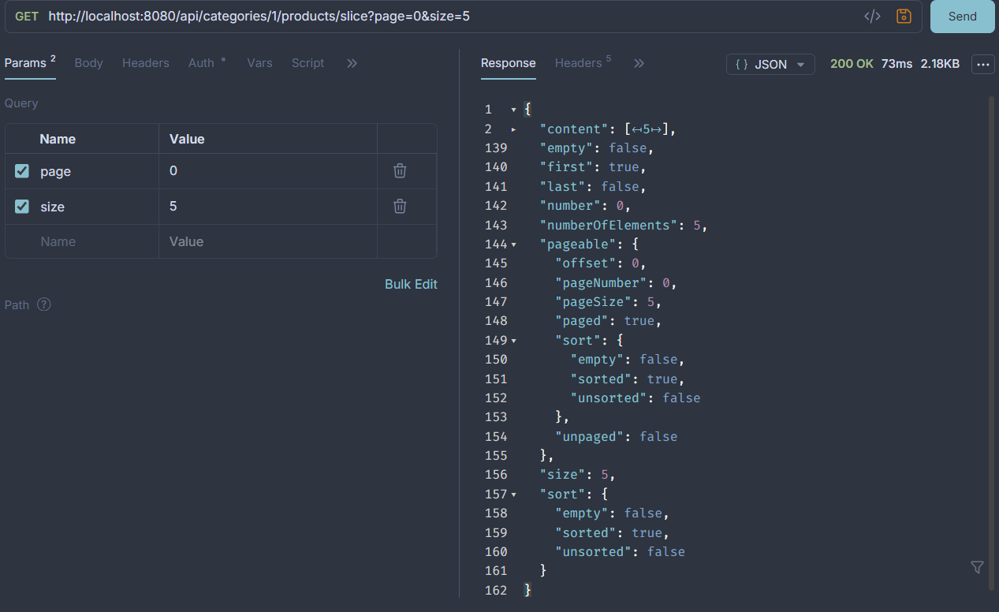

---

## Explicación Breve

**¿Cuál es la diferencia entre Page y Slice?**
> La principal diferencia radica en el rendimiento y en la metadata que retornan debido a cómo construyen sus consultas SQL. 
> * **`Page`** es más pesado porque ejecuta **dos consultas** a la base de datos: una para traer los datos solicitados (usando `LIMIT` y `OFFSET`) y otra consulta adicional `COUNT` para calcular el total exacto de registros en la tabla. Por esto, devuelve metadata completa como `totalElements` y `totalPages`, siendo ideal para tablas administrativas con botoneras de paginación exacta.
> * **`Slice`** es más eficiente porque ejecuta **una sola consulta** pidiendo la cantidad de registros solicitada más uno adicional. Al encontrar ese registro extra, sabe que existe una página siguiente, pero desconoce el total de datos. Es ideal para interfaces modernas de alto rendimiento como el "Scroll infinito".

**¿Por qué la paginación debe aplicarse en el repositorio y no después de traer todos los datos en memoria?**
> Aplicar la paginación en memoria destruye la escalabilidad de la aplicación. Si una tabla tiene millones de registros y paginamos en memoria (ej. usando `.subList()` en Java), la base de datos se verá obligada a hacer un `SELECT *` masivo. Esto provocará un cuello de botella en la red y saturará la memoria RAM del servidor (riesgo de colapso por `OutOfMemoryError`).
> Al aplicar la paginación directamente en la capa del **repositorio** usando `Pageable`, delegamos el trabajo al motor de base de datos (PostgreSQL). Este utiliza comandos nativos garantizando que por la red viajen exclusivamente los registros exactos que el cliente solicitó, manteniendo el sistema rápido y estable.